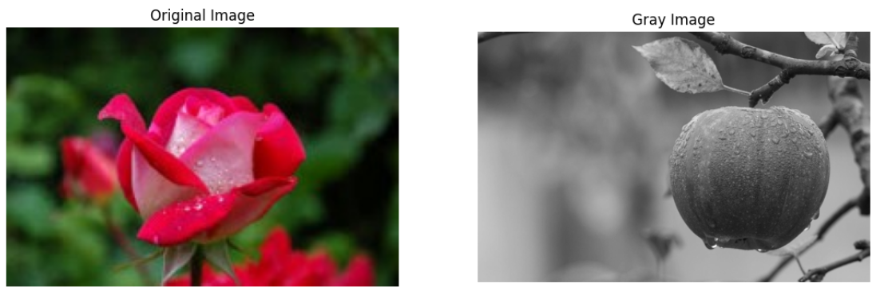
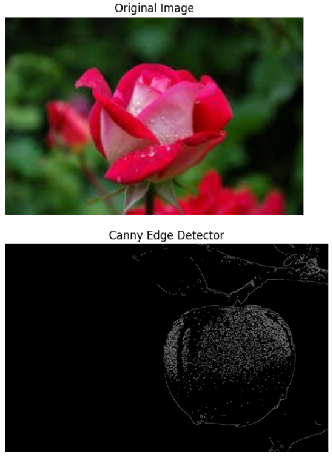
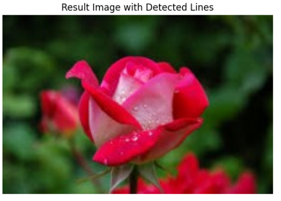

# Edge-Linking-using-Hough-Transformm
## Aim:
To write a Python program to detect the lines using Hough Transform.

## Software Required:
Anaconda - Python 3.7

## Algorithm:
### Step1:

Import all the necessary modules for the program.
### Step2:

Load a image using imread() from cv2 module.
### Step3:

Convert the image to grayscale.
### Step4:

Using Canny operator from cv2,detect the edges of the image.
### Step5:

Using the HoughLinesP(),detect line co-ordinates for every points in the images.Using For loop,draw the lines on the found co-ordinates.Display the image.

## Program:
Developed by: Shaik Shoaib Nawaz

Register No: 212222240094

i.) Input image and grayscale image
```
import numpy as np
import cv2
import matplotlib.pyplot as plt

# Read the gray image using imread
gray = cv2.imread('gray.jpeg', cv2.IMREAD_GRAYSCALE)  # Replace 'image_path.jpg' with the actual path

# Read the color image using imread
img_c = cv2.imread('rose.jpg')  # Replace 'image_path.jpg' with the actual path

# Convert the color from BGR to RGB
img_c = cv2.cvtColor(img_c, cv2.COLOR_BGR2RGB)

# Convert the gray image to RGB (this step is optional if you want to visualize the gray image in an RGB plot)
gray_rgb = cv2.cvtColor(gray, cv2.COLOR_GRAY2RGB)

# Apply Gaussian blur
gray_blurred = cv2.GaussianBlur(gray, (3, 3), 0)

# Display original and grayscale images
plt.figure(figsize=(13, 13))
plt.subplot(1, 2, 1)
plt.imshow(img_c)
plt.title("Original Image")
plt.axis("off")
plt.subplot(1, 2, 2)
plt.imshow(gray_blurred, cmap='gray')
plt.title("Gray Image")
plt.axis("off")
plt.show()
```
ii.) Canny Edge detector output
```
# Apply Canny edge detection
canny = cv2.Canny(gray_blurred, 120, 150)

# Display the Canny edge detector result
plt.imshow(canny, cmap='gray')
plt.title("Canny Edge Detector")
plt.axis("off")
plt.show()
```
iii.) Display the result of Hough transform
```
# Draw the detected lines on the color image
if lines is not None:
    for line in lines:
        x1, y1, x2, y2 = line[0]
        cv2.line(img_c, (x1, y1), (x2, y2), (255, 0, 0), 3)

# Display the result image with lines
plt.imshow(img_c)
plt.title("Result Image with Detected Lines")
plt.axis("off")
plt.show()

```
## Output

### Input image and grayscale image

### Canny Edge detector output

### Display the result of Hough transform



## Result:
Thus, To write a Python program to detect the lines using Hough Transform is executed successfully.

